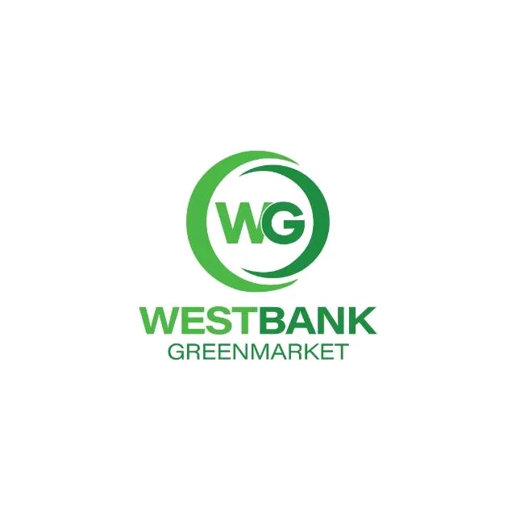

  

  

# Welcome to Westbank Green Market 🌿

Westbank Green Market is your trusted hub for sustainable agriculture, livestock, and fresh produce in Lower Shire, Malawi. Our mission is to provide high-quality, locally-grown crops and healthy livestock while empowering local farmers and communities.

---

## Our Projects

### 🐐 Goat Project
- Ethical and sustainable goat rearing for meat and milk.
- Goats raised with proper nutrition and care to ensure top-quality livestock.
- Reliable supply and traceable livestock for local markets and buyers.
- **Impact:** Supports smallholder farmers and generates steady revenue streams.

### 🌽 Maize Project
- Cultivation of high-yield maize varieties suited for the Lower Shire climate.
- Focus on quality control, organic practices, and sustainable soil management.
- Consistent supply for buyers seeking fresh, locally-grown maize.
- **Impact:** Enhances food security and creates community employment.

### 🥬 Fresh Produce & Other Crops
- Seasonal vegetables, fruits, and staples grown with care.
- Maintains high standards of hygiene and freshness to meet buyer demands.
- **Impact:** Provides nutritious food and supports small-scale farmers.

---

## Why Invest or Partner with Us?
- Reliable, traceable produce and livestock.
- Sustainable farming practices for long-term growth.
- Transparent operations with regular project updates.
- Direct access to local markets with high demand.

---

## Get Involved
- **Investors:** Explore opportunities in livestock, maize, and crop projects with detailed reports and ROI projections.  
- **Buyers:** Secure fresh, quality products directly from our farms.  
- **Community Partners:** Join us in empowering local farmers and growing sustainable agriculture in Malawi.
